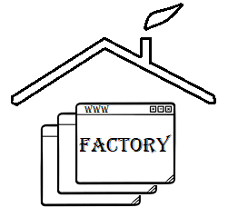

selenium-page-factory
=====================



Python library provides page factory approach to implement page object model in selenium


[](https://pypi.org/project/selenium-page-factory/)


[](https://pepy.tech/project/selenium-page-factory)

Introduction
============

* A Page Factory is one way of implementing a Page Object Model. In order to support the Page Object pattern.
* As in Java we are using @findBy, here we are declaring all web element in dictionary.
Dictionary keys become WebElement / class member variable with having all extended WebElement methods.
  

Main Features
=============

* Initialise all the webElements declared in Point at a time.
* All WebElements methods are re-define to add extra features eg- click method extended to have explicit wait for element to be clickable.
* Cent percent unittest coverage.
* Added Selnium 4 support for ActionChains methods

Installation
=============

```shell
  pip install selenium-page-factory
```

Pre-Requisite
=============
Every Page in Page Object Model should have WebDriver object as class member
as shown below

```python
class PageClass(PageFactory):

    def __init__(self,driver):
        self.driver = driver    # Required
        self.timeout = 15       #(Optional - Customise your explicit wait for every webElement)
        self.highlight = True   #(Optional - To highlight every webElement in PageClass)
```

Extended WebElements Methods
===================
<table>
  <tbody>
    <tr>
      <td >set_text</td>
      <td >get_text</td>
    </tr>
    <tr>
      <td >clear_text</td>
      <td >click_button</td>
    </tr>
    <tr>
      <td >double_click</td>
      <td >get_list_item_count</td>
    </tr>
	<tr>
      <td >select_element_by_text</td>
      <td >select_element_by_index</td>
    </tr>
	<tr>
      <td >select_element_by_value</td>
      <td >get_all_list_item</td>
    </tr>
	<tr>
      <td >get_list_selected_item</td>
      <td >highlight</td>
    </tr>
	<tr>
      <td >is_Enabled</td>
      <td >is_Checked</td>
    </tr>
	<tr>
      <td >getAttribute</td>
      <td >hover</td>
    </tr>
	<tr>
      <td >visibility_of_element_located</td>
      <td >invisibility_of_element_located</td>
    </tr>
	<tr>
      <td >element_to_be_clickable</td>
      <td >text_to_be_present_in_element</td> 
    </tr>
	</tr>
	<tr>
      <td >context_click</td>
      <td >execute_script</td> 
    </tr>
    </tr>
	</tr>
	<tr>
      <td >click_and_hold</td>
      <td >release</td> 
    </tr>
  </tbody>
</table>

 Note: 
 Every WebElement will be created after verifying it's Presence and visibility on Page at Run-Time. 
 

*[selenium-page-factory Documentation](https://selenium-page-factory.readthedocs.io)*

Selenium Python Framework Example *[here](https://github.com/NayakwadiS/Selenium_Python_UnitTest_HTML)*


